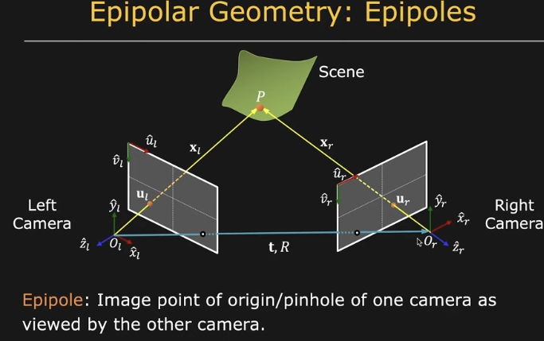
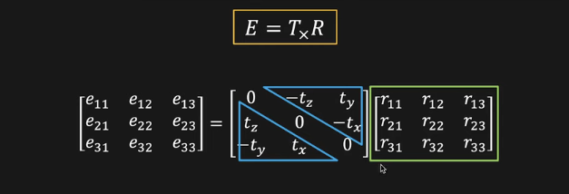

# Essential Matrix

The Essential Matrix is a fundamental concept in computer vision and photogrammetry, especially in the context of stereo vision and structure from motion. It encapsulates the geometric information between two calibrated cameras and is used to relate corresponding points between two images taken from different viewpoints.

## Definition
Given two corresponding points `p` in the first image and `p'` in the second image, the Essential Matrix `E` is defined such that for all pairs of corresponding points:

`p'^T * E * p = 0`

## Properties
1. The Essential Matrix `E` is a `3 x 3` matrix.
2. It has rank 2, which means it has two non-zero singular values.
3. The null space of `E` is the baseline (the line joining the two camera centers).

## Mathematical Derivation
The relationship between two corresponding points in two images, given the camera's intrinsic parameters and relative pose, can be expressed as:

`p' = R * p + t`

Where:
- `R` is the rotation matrix.
- `t` is the translation vector.

Using the cross product, we can express the above equation as:

`p' x (R * p + t) = 0`

This can be further written in matrix form as:

`[p']_x * R * p = 0`

Where `[p']_x` is the skew-symmetric matrix of `p'`.

The Essential Matrix `E` is then defined as:

`E = [t]_x * R`

Where `[t]_x` is the skew-symmetric matrix of `t`.

## Examples
1. **Two Cameras with Known Pose**: If you have two cameras with known relative pose (rotation and translation), you can compute the Essential Matrix using the formula `E = [t]_x * R`.
2. **Matching Points in Two Images**: If you have a set of matching points from two images, you can compute the Essential Matrix using algorithms like the 8-point algorithm. Once you have the Essential Matrix, you can decompose it to get the relative pose between the two cameras.
3. **Estimating Camera Pose**: Once you have the Essential Matrix, you can decompose it to estimate the relative rotation and translation between the two camera views. This is crucial for tasks like 3D reconstruction.

## Practical Applications
1. **3D Reconstruction**: By finding the Essential Matrix between two images, one can triangulate corresponding points to reconstruct the 3D structure of the scene.
2. **Camera Calibration**: The Essential Matrix can be used to calibrate cameras in a stereo setup.
3. **Motion Estimation**: In video sequences, the Essential Matrix can help estimate the camera's motion over time.

