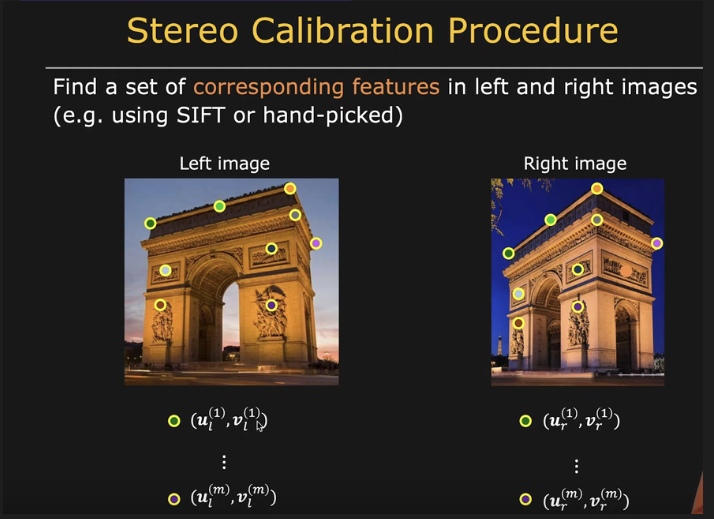
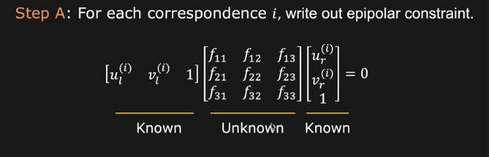
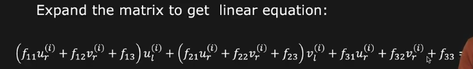
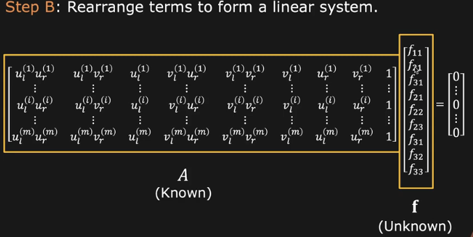

# Fundamental Matrix

The Fundamental Matrix is a core concept in computer vision, particularly in epipolar geometry, which describes the geometric relationship between corresponding points in two images taken from different viewpoints.

## Definition
Given two corresponding points `p` in the first image and `p'` in the second image, the Fundamental Matrix `F` is defined such that for all pairs of corresponding points:

`p'^T * F * p = 0`

### Intuition:
1. **Epipolar Geometry**: When two cameras view a 3D scene from two different positions, there are a few geometric entities that are inherently defined: epipolar lines, epipolar planes, and epipoles. The Fundamental Matrix encodes all of this geometry.

2. **Correspondence Problem**: Given a point in one image, where should we search for the corresponding point in the other image? The Fundamental Matrix tells us that the corresponding point must lie on a specific line in the other image, known as the epipolar line. This reduces the search from 2D (entire image) to 1D (a line).

3. **Uncalibrated Cameras**: The beauty of the Fundamental Matrix is that it can be computed without knowing the intrinsic parameters (like focal length, principal point) of the cameras. This makes it invaluable for scenarios where camera calibration is not available.

## Properties
1. The Fundamental Matrix `F` is a `3 x 3` matrix.
2. It has rank 2, which means it has two non-zero singular values.
3. The epipolar lines in each image can be computed using the Fundamental Matrix.

## Mathematical Derivation
The relationship between two corresponding points in two images, given the camera's intrinsic and extrinsic parameters, can be expressed as:

`p' = M' * X = M * X`

Where:
- `M` and `M'` are the projection matrices of the two cameras.
- `X` is the 3D point in the world coordinates.

The Fundamental Matrix `F` relates the two images such that:

`p'^T * F * p = 0`

## How is \(F\) Computed?
1. **Eight-Point Algorithm**: Given eight or more pairs of corresponding points in two images, \(F\) can be computed. The idea is to set up a system of linear equations using the above relationship and solve for \(F\).

Now add it in epipolar constraint and we will have to find fundamental matrix now :

- A*f*  = 0

Find least squares solution for fundamental matrix F

2. **Normalization**: It's often beneficial to normalize the point coordinates (to make them mean-centered and isotropic) before computing \(F\). This improves the numerical stability of the algorithm.

3. **Rank-2 Constraint**: The computed \(F\) matrix might not always satisfy the rank-2 constraint inherently. A common post-processing step is to decompose \(F\) using Singular Value Decomposition (SVD), set the smallest singular value to zero, and then recompose \(F\).

## Practical Applications
1. **Epipolar Line Computation**: The Fundamental Matrix can be used to compute the epipolar lines in stereo images.
2. **Rectification**: It aids in the rectification of stereo images, making them coplanar.
3. **3D Reconstruction**: By using the Fundamental Matrix, one can estimate the 3D structure of a scene from stereo images.

## Differences from Essential Matrix
While the Essential Matrix `E` encapsulates the geometric information between two calibrated cameras, the Fundamental Matrix `F` relates corresponding points between two images without considering the camera's intrinsic parameters. In essence, `F` is for uncalibrated cameras, while `E` is for calibrated ones.

